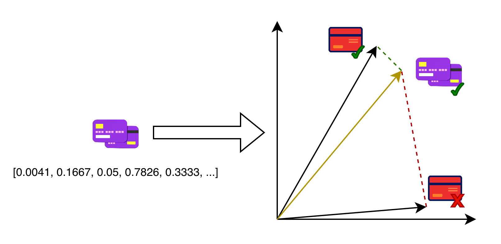
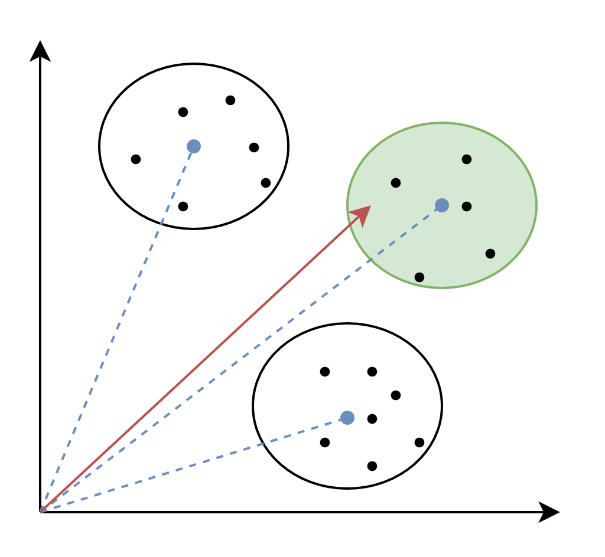
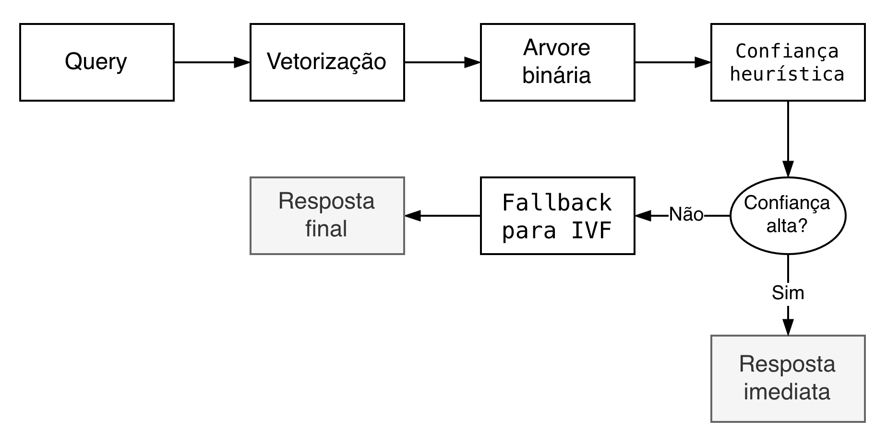
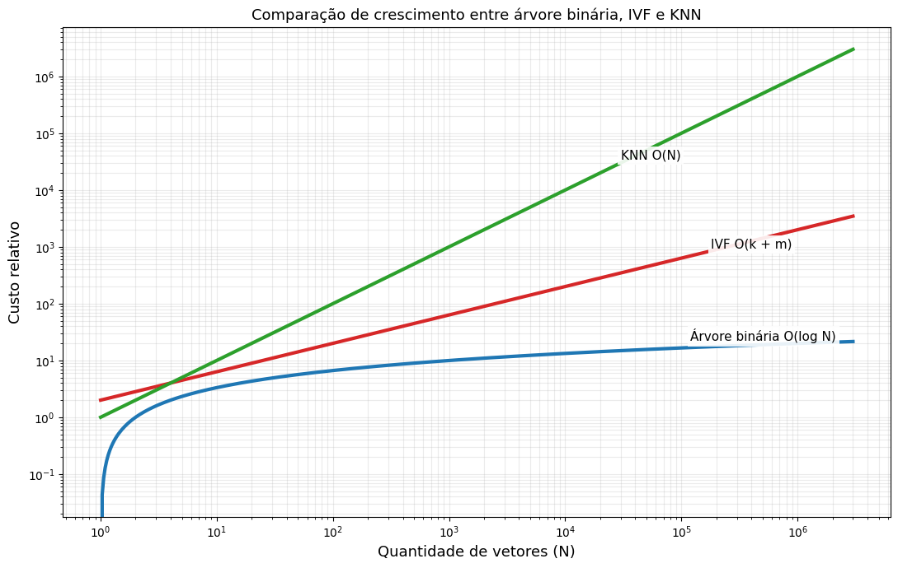
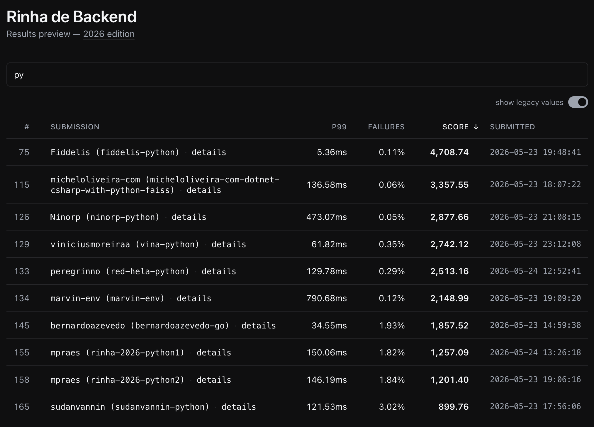

## Sumário

- [1. O desafio da Rinha de Backend 2026](#1-o-desafio-da-rinha-de-backend-2026)
- [2. Por que mandar tudo para IVF ainda é caro](#2-por-que-mandar-tudo-para-ivf-ainda-é-caro)
- [3. A arquitetura híbrida da solução](#3-a-arquitetura-híbrida-da-solução)
- [4. Confiança heurística](#4-confiança-heurística)
- [5. Engenharia de memória e cache locality](#5-engenharia-de-memória-e-cache-locality)
- [6. O impacto real de evitar trabalho](#6-o-impacto-real-de-evitar-trabalho)
- [Fontes](#fontes)

---

## 1. O desafio da Rinha de Backend 2026

A **rinha de backend**[^1] é uma competição na qual é proposto um problema a ser solucionado em um sistema com limitações de memória, CPU e arquitetura.

A rinha deste ano trouxe a proposta de detecção de fraudes em cartão de crédito utilizando busca vetorial. Para isso, recebemos 14 informações sobre cada compra, que precisam passar por um pipeline de vetorização e normalização, transformando o JSON recebido em um vetor de 14 posições. Abaixo está um exemplo de pipeline fornecido por eles[^2]:

```
1. recebe a requisição:
    {
      "id": "tx-1329056812",
      "transaction":      { "amount": 41.12, "installments": 2, "requested_at": "2026-03-11T18:45:53Z" },
      "customer":         { "avg_amount": 82.24, "tx_count_24h": 3, "known_merchants": ["MERC-003", "MERC-016"] },
      "merchant":         { "id": "MERC-016", "mcc": "5411", "avg_amount": 60.25 },
      "terminal":         { "is_online": false, "card_present": true, "km_from_home": 29.23 },
      "last_transaction": null
    }
          ↓
2. vetoriza e normaliza (14 dimensões):
    [0.0041, 0.1667, 0.05, 0.7826, 0.3333, -1, -1, 0.0292, 0.15, 0, 1, 0, 0.15, 0.006]
          ↓
3. busca os 5 vizinhos mais próximos (ex.: distância euclidiana):
    dist=0.0340  legit
    dist=0.0488  legit
    dist=0.0509  legit
    dist=0.0591  legit
    dist=0.0592  legit
          ↓
4. calcula o score (threshold 0.6):
    score = 0 fraudes / 5 = 0.0
    approved = score < 0.6 → true
          ↓
5. resposta:
    {
      "approved": true,
      "fraud_score": 0.0
    }
```

O principal problema dessa rinha é que temos um total de <mark>3 milhões de dados</mark> fornecidos por eles e **precisamos realizar a busca o mais rápido possível**, com a soma dos recursos utilizados limitada a, no máximo, <mark>1 CPU + 350 MB de memória</mark>[^6].

**Mas, então, como funciona uma busca vetorial?**

A busca vetorial consiste, literalmente, em transformar dados brutos em vetores, compará-los com seus vizinhos e verificar, no nosso caso, se eles são majoritariamente legítimos ou fraudes. Na rinha, recebemos 14 informações diferentes por compra, pegamos todas essas informações em formato _JSON_ e as passamos por uma função que normaliza os dados em um intervalo definido, normalmente entre 0 e 1. Isso é necessário porque a distância é extremamente sensível à escala dos valores; sem normalização, uma feature numérica com valores muito maiores domina o cálculo da distância ou da similaridade, mesmo que ela não seja a mais relevante.

Com esses dados normalizados, passamos para uma função que os vetoriza, para podermos compará-los com os outros dados que já temos.

<p align="center">
  
</p>

**Porém, aí vem o problema**

A maneira mais simples de implementar uma busca vetorial é calcular a distância entre o novo vetor e os vetores que já temos calculados, 3 milhões no total. O custo disso é enorme diante das limitações propostas, tornando inviável implementar esse _brute force_.

Essa busca é denominada KNN (_K-nearest neighbors_), um algoritmo extremamente custoso, com complexidade `O(N)`, o que significa que o tempo de busca aumenta de forma linear. Por isso, para resolver esse problema, é necessário utilizar um algoritmo que denominamos ANN (_approximate nearest neighbors_), no qual, em vez de compararmos um vetor com todos os outros que temos no banco, comparamos com um conjunto menor de dados. Aqui temos o nosso primeiro trade-off entre acurácia e performance.

O algoritmo de ANN que escolhi utilizar nessa rinha foi o **IVF (Inverted File Index)**, que particiona o espaço em "células" e busca apenas nas mais próximas da consulta. Essas células foram calculadas utilizando o modelo de ML K-Means, treinado em um subconjunto de 400.000 dados.

Abaixo está um exemplo de como funciona uma busca com IVF. Como os dados estão separados por células, podemos calcular inicialmente apenas a distância entre o novo vetor e o centro de cada célula, encontrando a célula mais próxima. Com isso, identificamos os dados que possivelmente estão mais perto do nosso vetor e recalculamos a distância usando apenas os vetores contidos nessa célula, reduzindo a complexidade do algoritmo para aproximadamente <mark>O(k + m)</mark>, em que `k` é o número de centroides e `m` é a quantidade de vetores analisados no cluster escolhido.

<p align="center">
  
</p>

## 2. Por que mandar tudo para IVF ainda é caro

Mesmo tendo reduzido as distâncias que precisamos calcular, ainda temos um total de 3M de dados que, se divididos, por exemplo, em 1000 clusters, ainda resultariam em 1000 comparações com os centroides + 3000 comparações dentro do cluster, totalizando 4000 vetores analisados por consulta. Isso certamente é muito melhor do que um _brute force_ em 3M de dados, porém, com as limitações de CPU e RAM que temos, ainda leva tempo, e precisamos tentar economizar ainda mais.

Por conta disso, precisamos analisar os dados que temos antes de qualquer outra otimização ou troca de algoritmo. Se analisarmos bem, veremos que muitos dos dados presentes no dataset são, de forma bastante evidente, fraudes ou transações legítimas. Um exemplo realista disso seria:

`Uma padaria recebe em uma das transações o valor de R$ 10,00, a probabilidade dessa compra ser uma fraude de cartão é extremamente baixa porque condiz com valores reais gastos nesses estabelecimentos, do mesmo modo, R$ 10.000,00 gasto em uma loja da Vivara também condiz com os valores gastos normalmente nesses estabelecimentos`

Porém:

`Qual é a chance de uma transação de R$ 5.000,00 em uma padaria ser uma fraude? Alta até demais.`

Diante disso, surge a pergunta central: faz sentido executar uma busca vetorial custosa para toda requisição recebida? Se parte desses casos puder ser resolvida com um caminho mais leve, talvez seja mais eficiente reservar o IVF apenas para as transações ambíguas ou mais difíceis de classificar. Isso abre espaço para uma abordagem híbrida, em que um algoritmo barato faz a triagem inicial e encaminha somente os casos incertos para a etapa mais cara. Na minha solução, esse papel ficou com uma <mark>árvore binária</mark>.

## 3. A arquitetura híbrida da solução

Partindo desse problema, a arquitetura que utilizei na minha solução foi baseada em um pipeline híbrido, onde nem toda requisição vai diretamente para o IVF. A ideia central foi bem simples: antes de executar a parte mais cara da busca vetorial, eu passo a transação por uma estrutura muito mais barata computacionalmente, responsável por fazer uma triagem inicial do caso.

Essa estrutura foi uma <mark>árvore binária</mark>, treinada para navegar rapidamente pelos padrões mais recorrentes do dataset. Na prática, ao inves de comparar a query com milhares de vetores logo de inicio, eu primeiro percorro uma sequência pequena de decisões hierárquicas até chegar em uma folha que representa um subconjunto muito mais especifico do espaço de busca.

O pipeline ficou da seguinte forma:

<p align="center">
  
</p>

A grande vantagem dessa abordagem é que a navegação na árvore é extremamente barata. Cada nó executa apenas uma decisão simples e a profundidade da árvore é pequena quando comparada ao custo de uma busca vetorial aproximada completa. Isso faz com que o custo dessa etapa fique muito próximo de <mark>O(log N)</mark>, enquanto o IVF, embora muito melhor que um brute force, ainda exige várias comparações com centroides e depois com vetores dentro do cluster selecionado.

<p align="center">
  
</p>

Na prática, a árvore funciona como um mecanismo de redução de espaço de busca. Em vez de tratar toda transação como se fosse um caso dificil, ela separa rapidamente os casos mais previsiveis dos casos mais ambiguos. Quando a decisão chega com confiança suficiente, eu aceito essa resposta imediatamente. Quando essa confiança não é alta o bastante, ai sim o sistema aciona o IVF para refinar a classificação. O critério utilizado para medir essa confiança é justamente o que explico na próxima seção.

Isso foi importante porque o objetivo principal da solução não era apenas acelerar a busca vetorial, mas sim <mark>evitar buscas vetoriais desnecessárias</mark>. Em um ambiente com CPU e memória extremamente limitados, deixar de fazer trabalho custa menos do que otimizar trabalho caro. Foi justamente nesse ponto que a arquitetura híbrida trouxe resultado real: queries fáceis eram resolvidas muito antes de chegar no pipeline pesado, enquanto apenas os casos que realmente precisavam de maior precisão eram encaminhados para o fallback.

## 4. Confiança heurística

Até aqui a árvore binária resolve um problema importante: ela cria um caminho barato para separar rapidamente os casos mais previsiveis dos mais ambiguos. Porém somente percorrer a árvore e cair em uma folha não é o bastante para aceitarmos qualquer resposta de forma cega. Era necessário definir, de forma objetiva, quando aquela resposta seria confiavel o bastante para encerrar a requisição ali mesmo.

Na minha solução, essa confiança heurística foi implementada de forma bem prática: cada folha da árvore carrega um `score`, e esse score representa o quão inclinada aquela região do espaço está para fraude ou para transação legitima. Quanto mais extremo esse valor, maior a confiança da decisão. Quanto mais próximo do meio, maior a ambiguidade.

Na prática, a árvore só responde sozinha quando esse score ultrapassa um limiar de confiança. No meu caso, a regra era simples: se a folha apontasse um valor muito alto ou muito baixo, a resposta era aceita imediatamente. Se o valor caisse em uma zona intermediária, a árvore não tentava adivinhar e a requisição era encaminhada para o IVF.

Em termos práticos, a heurística funcionava assim:

```text
score muito alto ou muito baixo -> aceita resposta da árvore
score intermediário             -> aciona fallback para IVF
```

Isso transformou a árvore em mais do que um classificador barato. Ela passou a funcionar como um filtro de confiança. Os casos fáceis eram resolvidos com custo extremamente baixo, enquanto os casos ambíguos eram promovidos para a busca vetorial aproximada, que apesar de mais cara, era usada apenas quando realmente fazia sentido.

Esse ponto foi importante porque o objetivo da heurística não era substituir completamente o IVF, e sim escolher melhor quando ele precisava ser usado. Se o limiar fosse permissivo demais, a solução ficaria rápida, mas passaria a aceitar respostas duvidosas da árvore com mais frequência. Se fosse conservador demais, quase tudo acabaria indo para o IVF e o ganho de latência desapareceria.

No fim, a confiança heurística foi justamente o mecanismo que tornou a arquitetura híbrida viavel: a árvore resolvia cedo apenas os casos em que havia convicção suficiente, e o IVF ficava reservado para os casos em que ainda existia ambiguidade real.

## 5. Engenharia de memória e cache locality

Até aqui a solução ja tinha reduzido bastante o trabalho feito por requisição. A árvore binária evitava parte das consultas caras e o IVF diminuia o espaço de busca. Porém ainda existia um gargalo importante: <mark>memória</mark>.

Com 3 milhões de vetores e um orçamento apertado de RAM, não basta apenas escolher um algoritmo melhor. A forma como os dados estão organizados em memória passa a importar muito. Se o processador precisa ficar saltando entre regiões dispersas o tempo todo, boa parte do custo deixa de ser cálculo e passa a ser espera por memória.

Por conta disso, o caminho principal da busca passou a operar sobre vetores quantizados em `uint8`, reduzindo footprint e barateando a etapa inicial de comparação. Depois disso, apenas um conjunto pequeno de candidatos era reranqueado em `float16`, recuperando precisão só onde ela realmente importava.

Outro ponto importante foi a reorganização física do índice. Durante o build, os vetores eram <mark>reordenados por cluster</mark>, fazendo com que a busca percorresse blocos muito mais sequenciais em memória. Isso melhorou locality, reduziu overhead e combinou muito melhor com cache de CPU[^3].

A árvore também seguiu essa mesma ideia. Em vez de uma estrutura baseada em objetos Python, ela foi armazenada em arrays planos com `scores`, `features`, `thresholds`, `left` e `right`, deixando a navegação mais compacta e barata.

Além disso, os artefatos eram carregados com <mark>mmap</mark>[^4] sempre que possivel, evitando inflar a heap logo no startup e permitindo um uso de memória mais controlado.

No fim, uma parte importante do ganho não veio apenas de fazer menos contas, mas de fazer essas contas em uma estrutura de dados muito mais amigável para a memória e para o processador.

## 6. O impacto real de evitar trabalho

No fim, o principal ganho dessa solução não veio apenas de trocar um algoritmo por outro, mas sim de <mark>evitar trabalho desnecessário</mark>.

Os números deixam isso claro. Na abordagem mais ingênua, utilizando KNN exato, o `P99` ficava em torno de <mark>2000ms</mark>. Era uma solução inviavel para o cenário da rinha, porque comparar a query com toda a base simplesmente custava caro demais.

Ao substituir o brute force por IVF, a latência caiu para <mark>147ms</mark>. Isso por si só ja foi um salto enorme, porque o espaço de busca passou a ser muito menor. Mesmo assim, ainda existia um custo consideravel em executar esse pipeline para toda requisição.

O ganho mais relevante apareceu quando a árvore binária entrou como etapa de triagem e o IVF passou a ser usado apenas nos casos ambíguos. Nesse ponto, o `P99` caiu para <mark>17ms</mark>. Essa diferença mostra exatamente o efeito da arquitetura híbrida: o sistema não ficou melhor apenas em fazer busca vetorial, ele passou a <mark>não fazer busca vetorial quando ela não era necessária</mark>.

Por fim, depois das otimizações de memória, quantização e locality, o `P99` chegou em torno de <mark>5ms</mark>[^5]. Na avaliação final publicada em <mark>23 de maio de 2026</mark>, a submissão registrou `5.36ms` de `P99`, com pontuação final de <mark>4708/6000</mark>, além de `23942` verdadeiros positivos, `30059` verdadeiros negativos, `58` falsos positivos, `0` falsos negativos e `0` erros HTTP[^5]. Aqui o ganho deixou de ser sobre reduzir espaço de busca e passou a ser sobre tornar o caminho restante mais barato para a CPU e para a memória.

O ponto central é que a maior melhora não veio apenas de buscar mais rapido, mas sim de <mark>decidir melhor quando buscar</mark>. Em um ambiente limitado como o da rinha, isso vale mais do que qualquer micro-otimização isolada. **Na data de publicação deste artigo, em <mark>25 de maio de 2026</mark>, essa solução ocupa a <mark>primeira colocação entre as implementações em Python no ranking da rinha</mark>**. Os resultados da submissão também podem ser consultados na issue publicada junto da solução[^5].

<p align="center">
  
</p>

---

## Fontes

[^1]: https://github.com/zanfranceschi/rinha-de-backend-2026

[^2]: https://github.com/zanfranceschi/rinha-de-backend-2026/blob/main/docs/br/README.md

[^3]: https://www.geeksforgeeks.org/dsa/why-arrays-have-better-cache-locality-than-linked-list/

[^4]: https://docs.python.org/3/library/mmap.htm

[^5]: https://github.com/zanfranceschi/rinha-de-backend-2026/issues/4265

[^6]: https://github.com/zanfranceschi/rinha-de-backend-2026/blob/main/docs/br/ARQUITETURA.md
